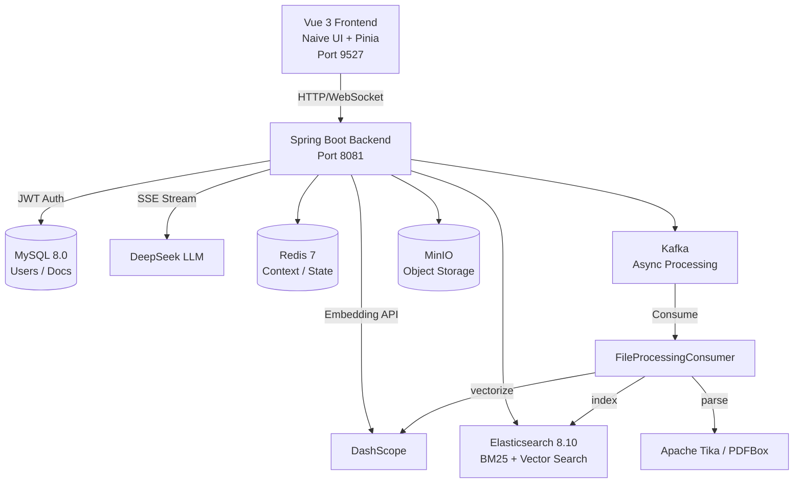
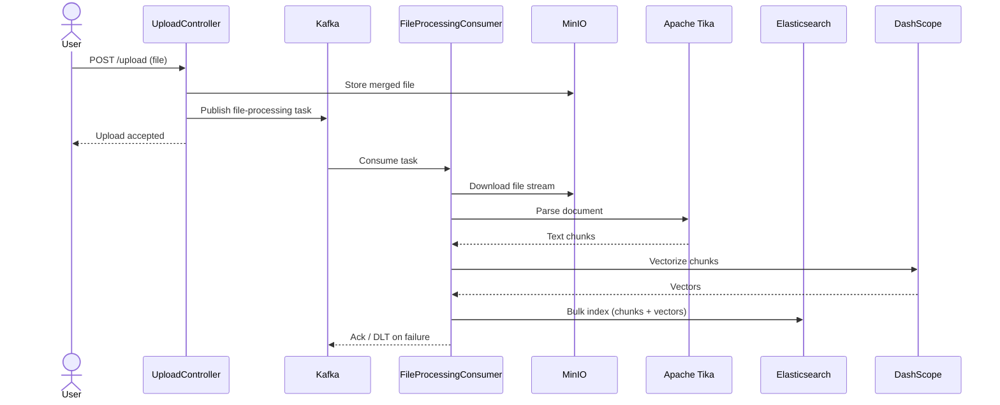
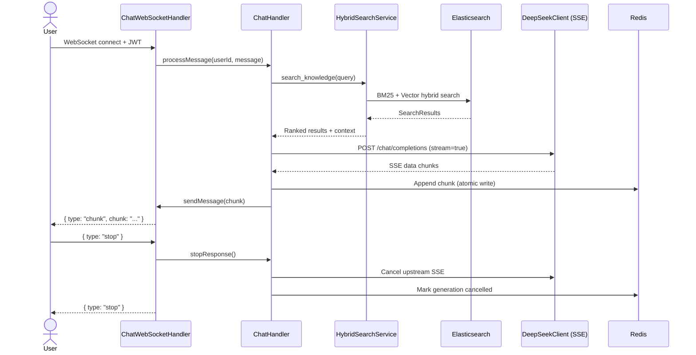

# dream-rag — 企业级异步流式知识引擎

基于 RAG（检索增强生成）的企业级 AI 知识库系统，支持多租户文档智能检索与对话问答，提供从文档上传、切片向量化到语义检索、流式对话的完整链路。

## 技术栈

| 层级 | 技术 |
|------|------|
| 后端框架 | Java 17 / Spring Boot 3.4 / WebFlux |
| 前端 | Vue 3 / TypeScript / Vite / Naive UI / Pinia |
| 搜索引擎 | Elasticsearch 8.10 |
| 消息队列 | Apache Kafka（异步文档处理） |
| 实时通信 | WebSocket（全双工流式对话） |
| 数据库 | MySQL 8.0 / Redis 7 |
| 对象存储 | MinIO |
| AI 集成 | DeepSeek API / DashScope Embedding |
| 安全 | Spring Security + JWT |
| 构建与运维 | Maven / pnpm / Docker Compose / Spring Boot Actuator |

## 系统架构



### 文档处理数据流



### WebSocket 流式对话



## 快速开始

### 前置条件

- Java 17+
- Node.js 18+ / pnpm
- Docker Desktop

### 1. 配置环境变量

```bash
cp .env.example .env
# 编辑 .env，至少填写 MySQL / Redis / MinIO / ES / JWT 等必需变量
# DEEPSEEK_API_KEY、EMBEDDING_API_KEY 可按需填写
```

### 2. 一键启动后端与基础设施

```bash
docker compose -f docs/docker-compose.yaml up -d --build
```

该 Compose 会启动 MySQL / Redis / ES / Kafka / MinIO 与 `dream-rag-app`，并基于 Actuator readiness 做容器健康检查。

启动后验证：

```bash
# 检查所有容器运行状态
docker compose -f docs/docker-compose.yaml ps

# 检查应用健康状态
curl -s http://localhost:8081/actuator/health

# 检查依赖就绪
curl -s http://localhost:8081/actuator/health/readiness
```

### 3. 本地源码方式启动后端

```bash
mvn spring-boot:run
```

启动后可通过 `http://localhost:8081/actuator/health` 验证。

### 4. 启动前端

```bash
cd frontend
pnpm install
pnpm dev
```

访问 http://localhost:9527

> 遇到问题？查看 `Dockerfile` 和 `docs/docker-compose.yaml` 了解完整配置。

## 环境变量

| 变量 | 说明 |
|------|------|
| `SPRING_DATASOURCE_URL` / `SPRING_DATASOURCE_USERNAME` / `SPRING_DATASOURCE_PASSWORD` | MySQL 连接 |
| `SPRING_DATA_REDIS_HOST` / `SPRING_DATA_REDIS_PORT` | Redis 连接 |
| `SPRING_KAFKA_BOOTSTRAP_SERVERS` | Kafka 地址 |
| `ELASTICSEARCH_HOST` / `ELASTICSEARCH_PORT` / `ELASTICSEARCH_PASSWORD` | Elasticsearch 连接 |
| `MINIO_ENDPOINT` / `MINIO_ACCESS_KEY` / `MINIO_SECRET_KEY` | MinIO 凭证 |
| `DEEPSEEK_API_KEY` | DeepSeek LLM API Key |
| `EMBEDDING_API_KEY` | 向量化服务 API Key |
| `JWT_SECRET_KEY` | JWT 签名密钥 (Base64) |

详见 `.env.example` 和 `src/main/resources/application.yml`。

## 核心功能

- **文档智能处理**：上传 → 解析 → 文本切片 → 向量化入库全流程自动化
- **异步消息驱动**：Kafka 解耦文件处理链路，支持重试与死信队列
- **混合语义检索**：Elasticsearch 关键词 + 向量相似度混合搜索
- **WebSocket 流式对话**：全双工通信，后端通过 WebFlux 消费 LLM SSE 流，经 WebSocket 推送到前端
- **断线续传与状态管理**：Redis 维护对话上下文窗口，断线重连自动恢复
- **多租户架构**：组织标签隔离，公开/私有文档权限控制

## 关键技术实现

### 1. Kafka 异步文档处理

文件上传后由 Kafka 生产者投递到 `file-processing-topic`，消费者 (`FileProcessingConsumer`) 顺序完成文件解析、文本切片与向量化入库。消费端配置重试与死信队列机制；当前展示版本默认按配置重试后将失败消息路由至死信队列 (`file-processing-dlt`)。

### 2. WebSocket 流式对话

基于 Spring WebSocket 实现全双工通信，后端通过 WebFlux 的 Reactive Stream 消费 LLM SSE 流，并以 WebSocket 逐帧推送到前端。支持用户主动中断生成，后端同步取消 LLM 连接。

### 3. Redis 上下文窗口

每段对话在 Redis 中维护 20 条消息的上下文窗口，供 LLM 调用时快速加载。完整对话历史持久化到 MySQL。每个流式 token 原子写入 Redis，通过状态机维持生成进度，增强弱网环境下的断线重连体验。

### 4. Elasticsearch 混合检索

结合 BM25 关键词检索与向量语义检索，支持文档级和段落级召回，可继续扩展 rerank。

## 运维与可观测性

- `Dockerfile`：后端多阶段构建，运行镜像内置健康检查。
- `docs/docker-compose.yaml`：基础设施与后端应用统一编排；MySQL、Redis、Kafka、ES、MinIO、应用服务均配置健康检查。
- `/actuator/health`：应用健康状态。
- `/actuator/health/liveness`：进程存活探针。
- `/actuator/health/readiness`：依赖就绪探针，适合 Docker / K8s readiness check。
- `GlobalExceptionHandler`：统一未捕获异常响应格式，减少堆栈和敏感配置外泄风险。

---

## 面试官源码阅读导航

> 如果您正在评估候选人此项目的技术深度，以下路径可按优先级阅读。每级标注了预估阅读时间与涉及的核心技术概念。

### 第一优先：文档处理与异步链路 （预估 30-45 分钟）

核心技术：Spring Boot · Kafka · Elasticsearch · Apache Tika · 向量化

| 文件 | 关注点 |
|------|--------|
| `src/main/java/com/cty/dreamrag/service/DocumentService.java` | 文档上传、解析、管理 |
| `src/main/java/com/cty/dreamrag/consumer/FileProcessingConsumer.java` | Kafka 消费端："解析→切片→向量化"全流程 |
| `src/main/java/com/cty/dreamrag/service/ElasticsearchService.java` | ES 索引与混合检索 |
| `src/main/java/com/cty/dreamrag/config/KafkaConfig.java` | Kafka 生产者/消费者配置 |

### 第二优先：WebSocket 流式对话与状态管理 （预估 25-35 分钟）

核心技术：WebSocket · WebFlux · SSE · Redis 状态机 · ReAct Agent 循环

| 文件 | 关注点 |
|------|--------|
| `src/main/java/com/cty/dreamrag/handler/ChatWebSocketHandler.java` | WebSocket 消息处理器，流式推送核心 |
| `src/main/java/com/cty/dreamrag/client/DeepSeekClient.java` | DeepSeek LLM SSE 流式调用 |
| `src/main/java/com/cty/dreamrag/service/ChatHandler.java` | ReAct 工具循环与流式响应管理 |
| `src/main/java/com/cty/dreamrag/service/ChatGenerationStateService.java` | 生成状态机与断线续传 |
| `src/main/java/com/cty/dreamrag/service/ChatSessionRegistry.java` | 会话注册与上下文管理 |

### 第三优先：安全与架构 （预估 15-20 分钟）

核心技术：Spring Security · JWT · 多租户 · Docker · Actuator

| 文件 | 关注点 |
|------|--------|
| `src/main/java/com/cty/dreamrag/config/SecurityConfig.java` | Spring Security + JWT 安全配置 |
| `src/main/java/com/cty/dreamrag/config/JwtAuthenticationFilter.java` | JWT 认证过滤器 |
| `src/main/java/com/cty/dreamrag/config/OrgTagAuthorizationFilter.java` | 多租户组织权限控制 |
| `src/main/java/com/cty/dreamrag/service/ConversationService.java` | 对话持久化与历史管理 |
| `src/main/java/com/cty/dreamrag/exception/GlobalExceptionHandler.java` | 全局异常处理与统一错误响应 |
| `Dockerfile` / `docs/docker-compose.yaml` | 容器化、健康检查、环境变量化配置 |

### 第四优先：前端核心 （预估 10-15 分钟）

核心技术：Vue 3 · TypeScript · Naive UI · Pinia · WebSocket 客户端

| 文件 | 关注点 |
|------|--------|
| `frontend/src/views/` | Vue 页面组件（聊天、知识库、文档管理） |
| `frontend/src/service/` | API 调用层 |
| `frontend/src/store/` | Pinia 状态管理 |

### 代码规模

Java 139 · TypeScript 150 · Vue 94 · 总计约 480 个源文件

**总预估阅读时间：约 80-115 分钟**（聚焦核心链路，不含第三方模板与通用后台代码）

---

## 项目范围说明

本仓库为学习实践、二次开发与面试复盘用途的源码展示版本，已移除真实密钥并统一了公开仓库中的项目命名。仓库不声明所有代码均为从零自研；前端管理后台、通用组件包、工程脚手架与部分业务扩展代码可能来源于开源项目或模板工程的学习与改造，原始作者信息与许可证声明应继续保留，详见 `NOTICE.md`。

代码阅读重点是 RAG 文档处理链路、Kafka 异步消费、Elasticsearch 检索、WebSocket 流式对话、Redis 生成状态管理等后端工程实现。仓库中保留的 Token 配额/充值相关代码属于可选业务扩展。个人复盘/答辩时建议只围绕自己能够解释清楚的核心链路展开。

## License

See `LICENSE` and `NOTICE.md`. Third-party/open-source/template components retain their original license and attribution requirements.
