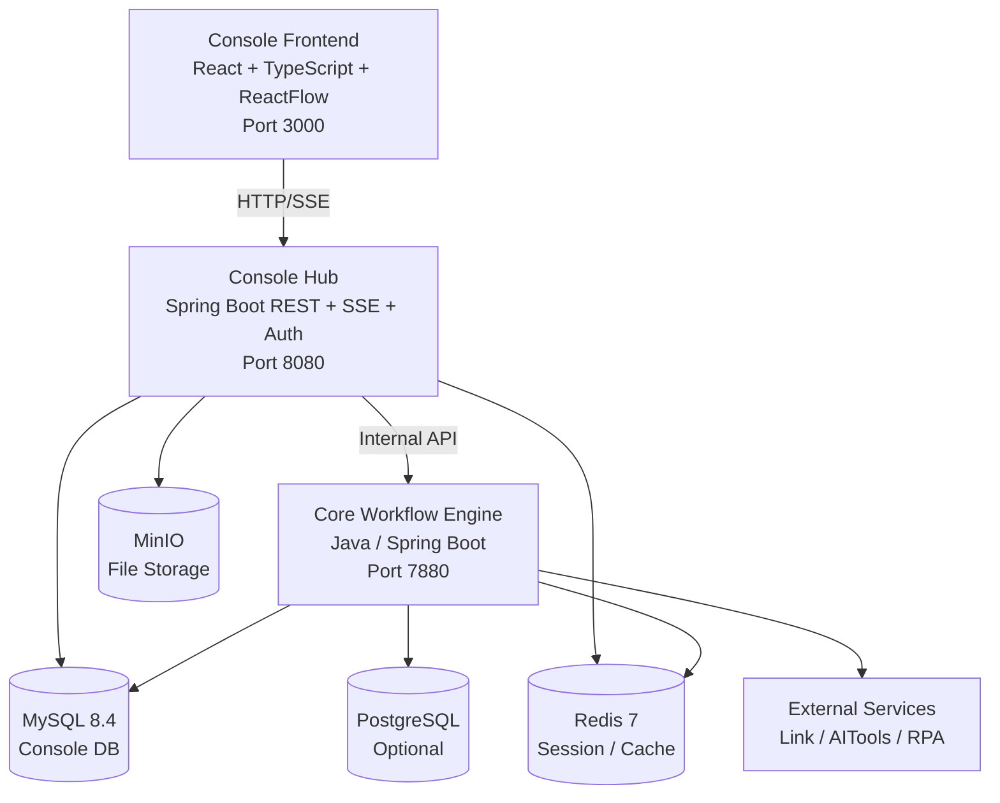
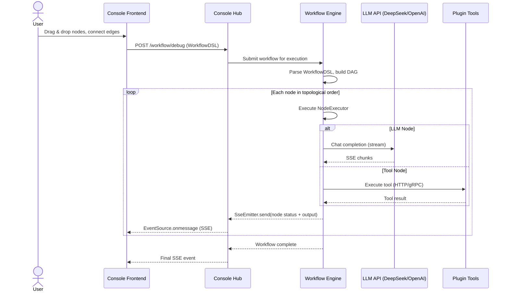
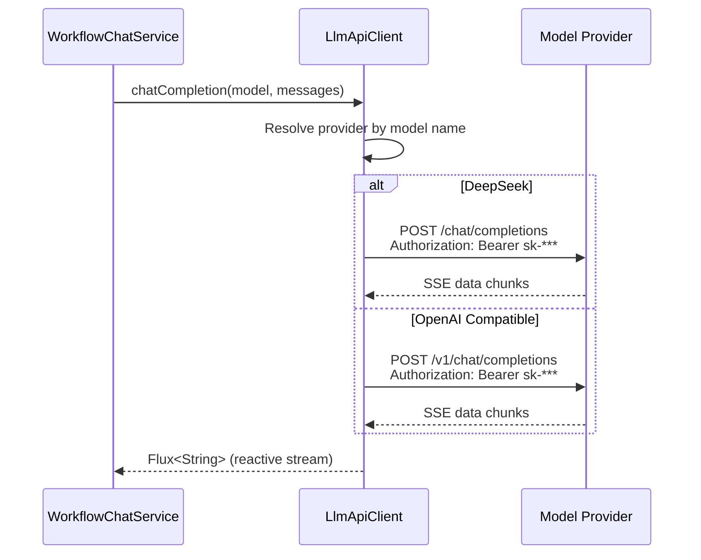

# zhimeng-ai-workflow — 企业级 AI Agent 可视化工作流编排平台

支持拖拽式编排 LLM 节点、工具节点与逻辑控制流，提供从工作流设计、调试到发布的完整生命周期管理的 Multi-Agent 工作流编排系统。

## 技术栈

| 层级 | 技术 |
|------|------|
| 后端框架 | Java 21 / Spring Boot 3.5 / Spring AI 1.1 |
| 工作流引擎 | 自定义 WorkflowDSL / DAG 调度 / NodeExecutor |
| 前端 | React 18 / TypeScript 5.9 / Vite 5.4 / Ant Design 5 / ReactFlow |
| 数据库 | MySQL 8.4 / PostgreSQL / Redis 7 |
| 对象存储 | MinIO |
| 持久层 | MyBatis-Plus 3.5 |
| 部署 | Docker Compose |

## 系统架构



### 工作流执行流程



### 多模型统一网关



## 快速开始

### 前置条件

- JDK 21+
- Node.js 18+
- Docker Desktop

### 1. 启动基础设施

```bash
cd docker/zhimeng-ai
cp .env.example .env
docker compose up -d
```

启动后验证：

```bash
docker compose ps                            # 所有容器运行状态
curl -s http://localhost:8080/actuator/health  # Console Hub 健康检查
```

### 2. 启动后端

```bash
# Console Hub
cd console/backend
mvn clean install -DskipTests
mvn spring-boot:run -pl hub

# Workflow Engine
cd core-workflow-java
mvn spring-boot:run
```

### 3. 启动前端

```bash
cd console/frontend
npm install
npm run dev
```

访问 http://localhost:1881

## 环境变量

| 变量 | 说明 | 默认值 |
|------|------|--------|
| `MYSQL_HOST` / `MYSQL_PORT` / `MYSQL_DB` | MySQL 连接 | localhost / 3306 / zhimeng-ai-console |
| `MYSQL_USER` / `MYSQL_PASSWORD` | MySQL 凭证 | root / (必填) |
| `REDIS_HOST` / `REDIS_PORT` | Redis 连接 | localhost / 6379 |
| `OSS_ENDPOINT` / `OSS_ACCESS_KEY_ID` / `OSS_ACCESS_KEY_SECRET` | MinIO 凭证 | (必填) |
| `DEEPSEEK_API_KEY` | DeepSeek API Key | (必填) |

完整配置参见 `docker/zhimeng-ai/.env.example`。

## 核心功能

- **可视化工作流编排**：基于 ReactFlow 的拖拽式节点编排，支持 LLM 节点、工具节点、条件分支
- **Java 工作流执行引擎**：基于 Spring Boot + 自定义 WorkflowDSL 实现节点编排、执行调度与状态推进
- **多模型统一调用**：通过 Spring AI 统一抽象层接入 DeepSeek、OpenAI 等模型
- **SSE 实时流式推送**：基于 Spring SseEmitter，工作流执行进度、LLM 流式输出、节点状态变更毫秒级同步到前端
- **插件生态**：支持 MCP 协议、工具注册系统、语音合成插件

## 关键技术实现

### 工作流执行引擎

基于自定义 `WorkflowDSL`、`WorkflowEngine` 与 `NodeExecutor` 多态执行器实现轻量级 DAG 工作流执行引擎。系统参考图式编排思想，通过边驱动的顺序/并行执行链路完成从输入节点到 LLM、工具插件再到输出节点的流程推进。

### 多模型统一网关

基于 Spring AI 设计轻量级客户端工厂，将 OpenAI、DeepSeek 等模型的调用差异抹平为标准的流式响应，支持业务方通过配置快速切换底层模型。

### Docker Compose 一键部署

统一管理 MySQL、Redis、MinIO、Console Hub 及 Workflow Engine 等 5+ 核心服务的依赖关系与健康检查。

## 运维与可观测性

- `Dockerfile`：前后端多阶段构建，运行镜像内置健康检查。
- `docker/zhimeng-ai/docker-compose.yaml`：基础设施与后端应用统一编排；MySQL、Redis、MinIO 均配置健康检查。
- `/actuator/health`：应用健康状态。
- `/actuator/health/liveness`：进程存活探针。
- `/actuator/health/readiness`：依赖就绪探针，适合 Docker / K8s readiness check。

---

## 面试官源码阅读导航

> 如果您正在评估候选人此项目的技术深度，以下路径可按优先级阅读。每级标注了预估阅读时间与涉及的核心技术概念。

### 第一优先：工作流执行引擎 （预估 40-60 分钟）

核心技术：DAG 调度 · NodeExecutor 多态 · WorkflowDSL · 拓扑排序 · 并行执行

| 文件 | 关注点 |
|------|--------|
| `core-workflow-java/src/main/java/com/zhimeng/ai/workflow/engine/WorkflowEngine.java` | 工作流执行主引擎，DAG 拓扑调度 |
| `core-workflow-java/src/main/java/com/zhimeng/ai/workflow/engine/node/NodeExecutor.java` | 节点执行器接口（多态设计） |
| `core-workflow-java/src/main/java/com/zhimeng/ai/workflow/engine/node/AbstractNodeExecutor.java` | 节点执行器抽象基类 |
| `core-workflow-java/src/main/java/com/zhimeng/ai/workflow/engine/ParallelWorkflowEngine.java` | 并行执行引擎 |
| `core-workflow-java/src/main/java/com/zhimeng/ai/workflow/engine/domain/WorkflowDSL.java` | 工作流 DSL 定义 |
| `core-workflow-java/src/main/java/com/zhimeng/ai/workflow/engine/constants/NodeTypeEnum.java` | 节点类型枚举（LLM/Plugin/条件分支等） |

### 第二优先：SSE 流式推送与多模型调用 （预估 25-35 分钟）

核心技术：Spring SseEmitter · Spring AI · Flux · LLM 流式回调

| 文件 | 关注点 |
|------|--------|
| `console/backend/hub/src/main/java/com/zhimeng/ai/console/hub/controller/WorkflowChatController.java` | SSE 端点，流式响应 |
| `console/backend/hub/src/main/java/com/zhimeng/ai/console/hub/service/WorkflowChatService.java` | 工作流聊天服务 |
| `console/backend/hub/src/main/java/com/zhimeng/ai/console/hub/client/LlmApiClient.java` | 多模型统一调度（OpenAI兼容） |
| `console/backend/hub/src/main/java/com/zhimeng/ai/console/hub/service/chat/impl/BotChatServiceImpl.java` | Bot智能体聊天服务 |

### 第三优先：前端与部署 （预估 15-20 分钟）

核心技术：ReactFlow · Ant Design · Docker Compose · 健康检查

| 文件 | 关注点 |
|------|--------|
| `console/frontend/src/components/` | ReactFlow 工作流画布组件 |
| `docker/zhimeng-ai/docker-compose.yaml` | 服务编排与健康检查 |

### 代码规模

Java 1233 · TypeScript/React 548 · 总计约 1800 个源文件（本仓库主要包含 Console 前后端与 Java Workflow Engine；外部 Python/FastAPI 插件服务未纳入本次 GitHub 展示）

**总预估阅读时间：约 80-115 分钟**（聚焦核心链路，不含模板代码与通用后台模块）

---

## 项目范围说明

本仓库为学习实践、二次开发与面试复盘用途的源码展示版本，已移除真实密钥并对公开仓库中的说明文档做了命名与技术表述校准。仓库不声明所有代码均为从零自研；Console、后台管理、工程脚手架与部分通用工具代码可能来源于开源项目或工程模板的学习与改造，原始作者信息与许可证声明应继续保留，详见 `NOTICE.md`。

代码阅读重点是可视化工作流编排、Java 工作流执行引擎、SSE 流式回调、多模型调用封装、插件节点执行与 Docker Compose 本地部署。个人复盘/答辩时建议只围绕自己能够解释清楚的核心链路展开。

## License

See `LICENSE` and `NOTICE.md`. Third-party/open-source/template components retain their original license and attribution requirements.
